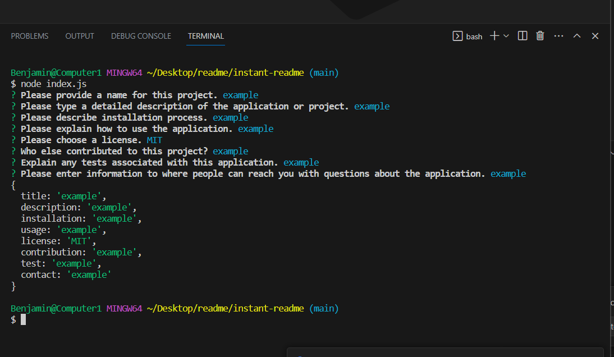

## Title
React Portfolio
## Description
This JavaScrypt application was created with React to display a porfolio of my projects. This portfolio is intended for use to attain a development job within the tech industry. This project furthered my knowledge of JS and the React library.

## Table of Contents
- [Usage](#Usage)
- [License](#license)
- [Contributing](#contributing)
- [Tests](#tests)
- [Contact](#contact)
## Installation
No installation process.
## Usage
Visit the deployed webpage to view the portfolio.
## License

## Contributing
Justin Moore
## Tests
No tests.
## Contact
GitHub: b-connolly1088
